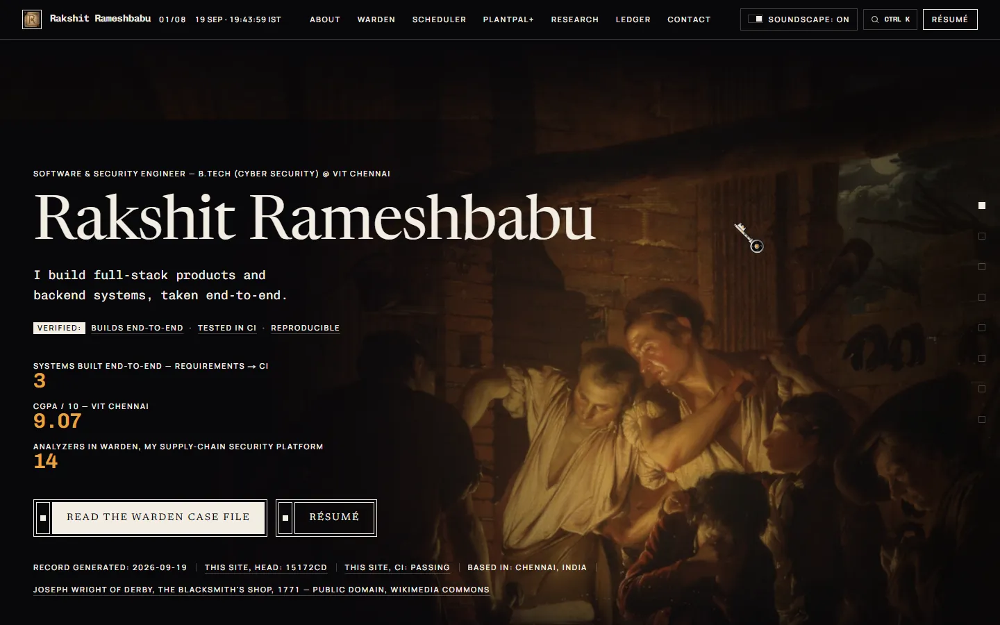
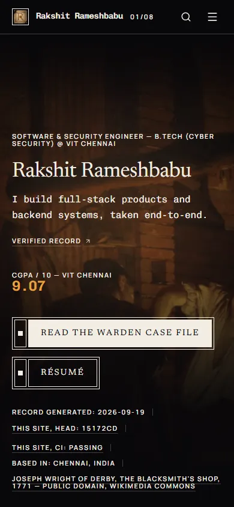

# Rakshit Rameshbabu — Portfolio

The portfolio of Rakshit Rameshbabu, Software & Security Engineer (B.Tech
Cyber Security, VIT Chennai): a scroll-driven, candlelit record built on
public-domain paintings, where a moving light reveals both the art and the
metrics.

<p align="center">
  <a href="https://rakshit-737.vercel.app"></a>
  <a href="https://rakshit-737.vercel.app"></a>
</p>

**Live:** https://rakshit-737.vercel.app · **mirror:** https://rakshit-737.github.io/portfolio/

[](https://github.com/rakshit-737/portfolio/actions/workflows/ci.yml)
[](https://github.com/rakshit-737/portfolio/actions/workflows/deploy-pages.yml)
[](LICENSE)
[](package.json)

Lighthouse (mobile / desktop, the CI gate's median of three,
[run 35447766777](https://github.com/rakshit-737/portfolio/actions/runs/35447766777),
measured 2026-09-19): performance 81 / 99 · accessibility 100 / 100 ·
best-practices 100 / 100 · SEO 100 / 100.

## What you're looking at

- **Eight acts, eight paintings.** Each section is set in a public-domain painting, cropped and committed with a checksum lockfile.
- **One lamp.** A single light follows scroll and pointer and reveals the painting; a measured number turns ember only when the light actually reaches it.
- **The night archive.** A synthesized candlelit soundscape, on by default after your first interaction, with one visible switch. There is no audio file in the repo.
- **The key and the lock.** On a fine pointer the cursor is a medieval key, and anything clickable shows the padlock it opens.
- **⌘K.** A command palette jumps to any section, opens any repo, or copies the email.

Every claim on the page carries its proof: a date, a status, the repo, and live CI data fetched at build time.

## Inside

- The lamp: [`src/components/Lamp.tsx`](src/components/Lamp.tsx), one rAF loop writing CSS custom properties; everything visual is CSS.
- The sound engine: [`src/lib/sound.ts`](src/lib/sound.ts), a Karplus–Strong string, drone and room tone, all Web Audio.
- The cursor: static SVG cursors in [`src/app/globals.css`](src/app/globals.css), the animated layer in [`public/cursors/`](public/cursors/), and the source and build in [`docs/design/cursors/`](docs/design/cursors/).
- The palette: [`src/components/CommandPalette.tsx`](src/components/CommandPalette.tsx).
- Build-time provenance: [`src/lib/github.ts`](src/lib/github.ts) fetches stars, head commit and CI status for every cited repo; any failure degrades to static text.
- For machines: an [`llms.txt`](src/app/llms.txt/route.ts) route, JSON-LD (`Person`, `WebSite`, `SoftwareSourceCode` per case study), sitemap, robots, and OG cards rendered at build time ([`src/app/og.png/`](src/app/og.png/)).
- Print: a stylesheet that drops the paintings, forces every act visible, and prints link targets.
- Security: response headers from [`scripts/csp.mjs`](scripts/csp.mjs) and [`/.well-known/security.txt`](public/.well-known/security.txt).

## Proof

CI ([`.github/workflows/ci.yml`](.github/workflows/ci.yml)) blocks every push and pull request on all of these:

- `check:art`: every committed plate matches its sha256 lockfile, so the build never contacts Wikimedia.
- `typecheck`, `lint`, `build`: zero errors.
- `budget`: a gzipped-JS ceiling per page plus a media ceiling for the paintings ([`scripts/check-budget.mjs`](scripts/check-budget.mjs)).
- `check:links`: every internal href, src and srcset in `out/` resolves under either deploy's base path; GitHub links get a non-blocking reachability check.
- `check:content`: the stranger test. An insider term (`dispatch instants`, `SDSC SP2`, `TOST`) may not appear on the index outside the act that explains it.
- `check:vercel`: `vercel.json`'s headers match `scripts/csp.mjs` exactly.
- `npm test`: Playwright smoke tests plus an axe scan at zero violations. The suite covers metadata and OG cards, JSON-LD, sitemap and robots, `security.txt` (the test fails once it expires, so it is renewed yearly), the recruiter's thirty-second path, the lamp surviving a full scroll, the sound gate, the cursor, and reduced-motion and no-JS fallbacks.
- The same smoke, lamp and sound suites run again under the production headers, and fail on any Content-Security-Policy violation.
- A second job builds the GitHub Pages sub-path shape and runs the link crawl and smoke suite against it.
- [`scripts/check-lighthouse.mjs`](scripts/check-lighthouse.mjs): category minimums on mobile and desktop (median of three runs) and a CLS cap. Thresholds only ever move up.

## Run it

```bash
npm install
npm run dev        # http://localhost:3000
npm run build      # static export to ./out
npm test           # Playwright + axe against ./out (build first)
```

| Command | Does |
| --- | --- |
| `npm run dev` | Local dev server at `http://localhost:3000` |
| `npm run build` | Static export to `./out` (zero type errors required) |
| `npm run start` | Serve the built `./out` with the pinned local `serve` |
| `npm run lint` / `npm run typecheck` | ESLint / `tsc --noEmit` |
| `npm test` | Playwright smoke + axe scan against `./out` |
| `npm run budget` | Gzipped-JS and media weight ceilings |
| `npm run check:links` / `check:content` / `check:vercel` | Link crawl / stranger test / headers drift |
| `npm run check:headers -- <url>` | Assert a live deploy's security headers |
| `npm run art` | Fetch and crop the eight plates from Wikimedia Commons, and write the lockfile (manual, never in CI) |
| `npm run check:art` | Verify every committed plate against the lockfile (the CI gate) |
| `node scripts/capture-readme.mjs` | Re-capture this README's images and the social preview from `./out` |

## Editing content

All copy lives in [`src/content.ts`](src/content.ts): bio, projects, act statements, achievements, certifications, skills, education, links and the closing line. Components only render what it exports, so a text edit never touches markup. Every claim traces to a linked repo or the owner's own input, with a source comment beside it. `acts` holds one display line per act, each condensed from copy elsewhere in the file. `certifications` carries the credential itself, and an entry whose scan is absent renders its text alone.

## Deployment

**Vercel (primary).** Zero-config static export. The canonical URL, OG tags, sitemap, robots and JSON-LD all emit `https://rakshit-737.vercel.app` (`site.url` in `src/content.ts`). Vercel builds on push only, so [`refresh-vercel.yml`](.github/workflows/refresh-vercel.yml) rebuilds it every Monday through a deploy hook. It needs the repository secret `VERCEL_DEPLOY_HOOK` (Vercel → Settings → Git → Deploy Hooks); until that exists the run skips with a notice.

**Response headers.** [`vercel.json`](vercel.json) sends a Content-Security-Policy, `X-Content-Type-Options: nosniff`, `Referrer-Policy: strict-origin-when-cross-origin`, a `Permissions-Policy` that denies camera, microphone, geolocation, payment and USB, and `X-Frame-Options: DENY`. Vercel already sends HSTS. The policy is written once, in [`scripts/csp.mjs`](scripts/csp.mjs), with the reason for every allowance:
- Next's static export hydrates through inline scripts, and there is no server to mint nonces, so `script-src` allows `'unsafe-inline'`. That is fenced by `object-src 'none'`, `base-uri 'self'` and `frame-ancestors 'none'`.
- Plate placeholders, React `style` attributes, the lamp's custom properties and the data-URI cursors need `style-src 'unsafe-inline'` and `img-src data:`.
- Nothing fetches at runtime (`connect-src 'self'`), and every sound is synthesized (`media-src 'none'`).

After a deploy, run `npm run check:headers -- https://rakshit-737.vercel.app`, or the *Check live headers* workflow.

**GitHub Pages (mirror).** [`deploy-pages.yml`](.github/workflows/deploy-pages.yml) deploys once CI passes on `main`, and again weekly. It serves the files from `/portfolio` but pins `NEXT_PUBLIC_SITE_URL` to the primary, so search engines see one site. GitHub Pages cannot send custom headers.

| Variable (build-time, optional) | Purpose | Default |
| --- | --- | --- |
| `NEXT_PUBLIC_SITE_URL` | The site's one address: canonical, OG, sitemap, robots, JSON-LD | `https://rakshit-737.vercel.app` |
| `NEXT_PUBLIC_BASE_PATH` | Sub-path prefix when not served from the domain root | empty |

## Repo map

- `src/`: the app (`app/` routes, `components/`, `lib/`) and `content.ts`, the single source of words.
- `public/`: the plates (`art/`), certificate scans, the résumé, the cursor scripts, icons and `.well-known/`.
- `scripts/`: the art pipeline, every CI check, the header tooling and the README capture.
- `tests/`: the Playwright suites; the three `playwright*.config.ts` files at the root run them in the root, sub-path and production-headers shapes.
- `docs/`:
  - `design/cursors/`: cursor artwork source and build.
  - `screens/`: before/after captures, WebP.
  - `superpowers/`: dated plans and rulings.
  - `readme/`: this file's images.
  - Briefs, the résumé diff and the design notes.
- `AGENTS.md`: the working rules every change follows.
- `DESIGN.md`: the authority on the visual system.
- `PRODUCT.md`: who the site is for and what it may claim.
- `.impeccable/design.json`: the design-tool state those documents came from.

The working method is written down, not remembered. [`docs/design-notes.md`](docs/design-notes.md) is the narrative of how the design got here.

## Credits

- **Paintings:** eight public-domain works from Wikimedia Commons. Each is credited on its plate, and the full table is in [`DESIGN.md`](DESIGN.md) and [`src/lib/art.ts`](src/lib/art.ts).
- **Fonts:** Newsreader, Manrope, Chivo and Chivo Mono, self-hosted with `next/font`, under the SIL Open Font License.
- **Interaction references:** the CollectUI set credited commit by commit, collected in [`docs/collectui-improvisation-prompt.md`](docs/collectui-improvisation-prompt.md).

## Licence

The code is [MIT](LICENSE). The licence does not extend to what the code
presents:

- the written content (`src/content.ts` and every word it renders), the
  résumé, the certificate scans in `public/certificates/`, the name
  "Rakshit Rameshbabu", and the seal mark (`public/icon.png` and the images
  made from it: `public/mark.png`, `public/apple-icon.png`,
  `public/favicon.ico`) are © 2026 Rakshit Rameshbabu, all rights reserved,
  and not licensed for reuse;
- the eight paintings in `public/art/` are public domain, sourced from
  Wikimedia Commons and credited on every plate and in `DESIGN.md`;
- the fonts are under the SIL Open Font License.

## Known open items

- **The *Alchemist* plate (the About act) reads weak on phones.** Every crop is landscape and a phone is tall, so `object-fit: cover` has no vertical slack. A portrait crop helps but does not solve it; a tighter narrow crop is the real fix.
- **The PlantPal+ exhibit is waiting for its captures.** It stays absent rather than showing a placeholder (`public/exhibits/README.md`).
- **More achievements and certifications** can only come from the owner. Add them to `content.ts`, with any scan in `public/certificates/`.
